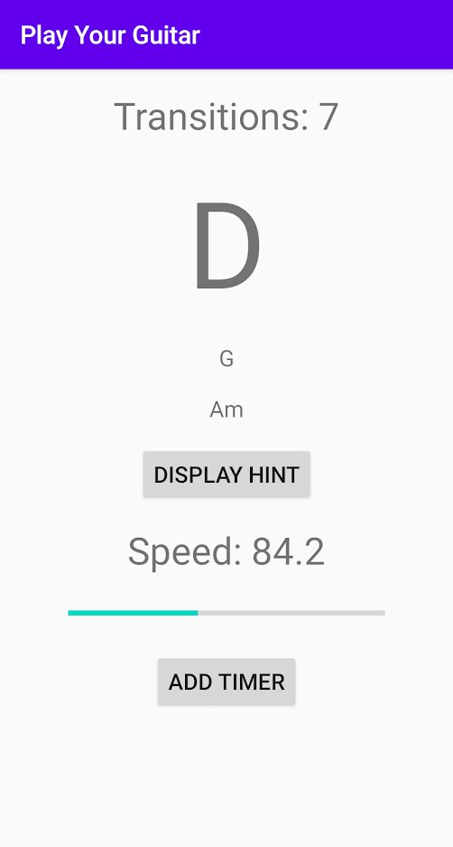

# GuitarChordTrainer
This is the full source code my app "Guitar Chord Trainer" which you can find here:  
https://play.google.com/store/apps/details?id=com.jameshc.guitarchordtrainer  
It detects what chords you are playing by analysing the microphone input, here is a screenshot:  

During the first lockdown from covid I decided to buy a guitar and learn how to play. I found many apps that help you 
tune your guitar and some even allowed you to practice basic chords by listening to the microphone input. After a while 
I became curious as to how these worked and annoyed at the small number of chords offered in the free apps, so I set out 
to create my own.

The basic theory is as follows:  
1. Record microphone input
2. Take the fourier transform of the recorded audio
3. Group the amplitudes into the 12 semitones
4. Determine which chord it is closest to by comparing it with the ideal PCP (pitch class profile) of each chord

Most of this is primarily based upon the work done by Takuya Fujishima in 1999, linked here:  
http://hdl.handle.net/2027/spo.bbp2372.1999.446
